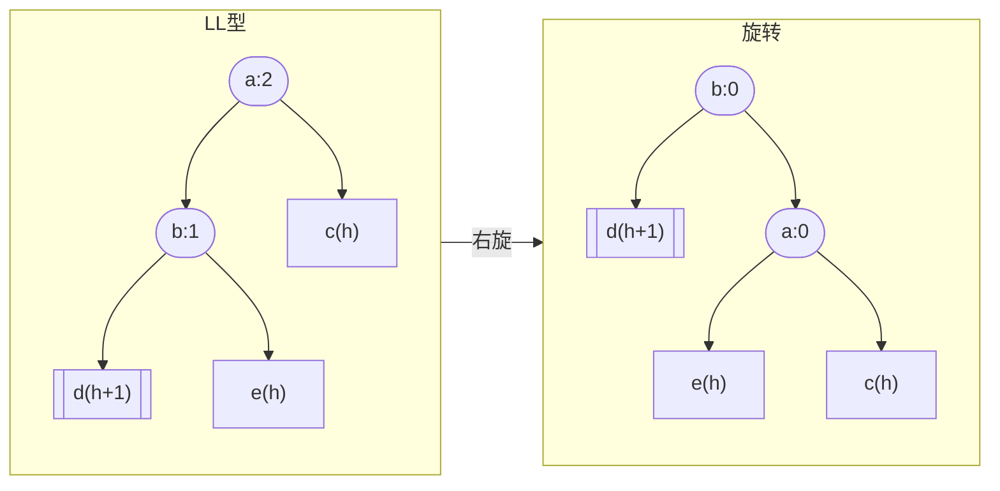
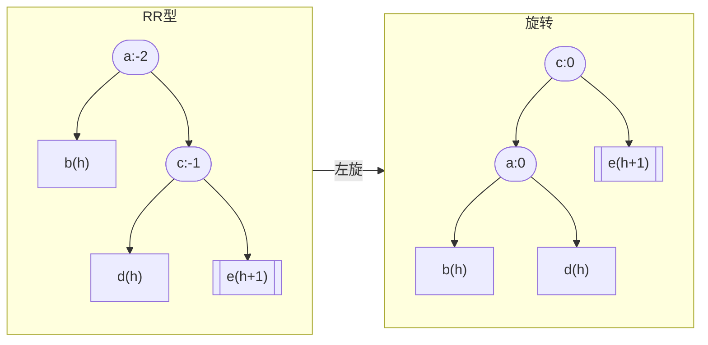
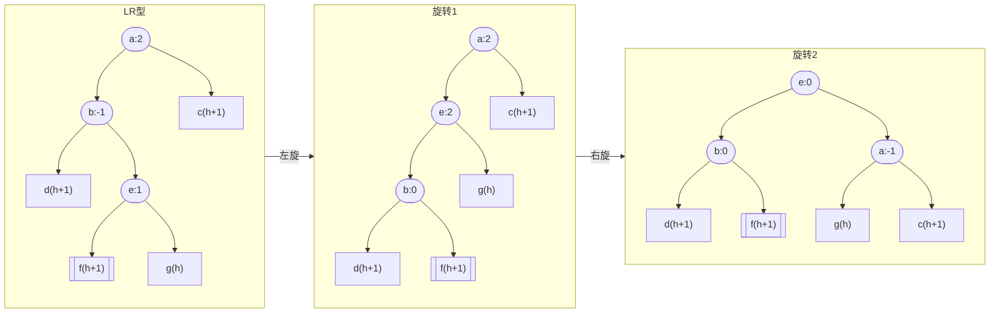
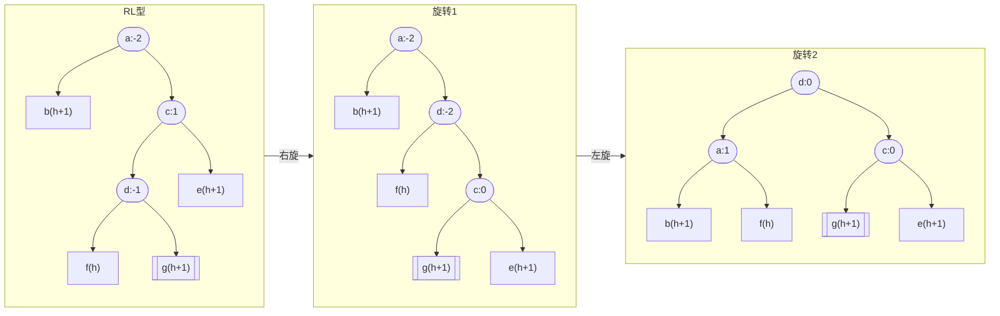
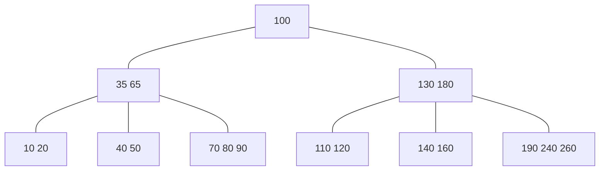

[参考](https://zq99299.github.io/dsalg-tutorial/dsalg-java-hsp/10/01.html#树的常用术语)

## 二叉树
- binary tree, 每个节点最多只有两个分支
- 完全二叉树, Complete Binary Tree, 在一棵二叉树中，若除最后一层外的其余层都是满的，并且最后一层要么是满的，要么在右边缺少连续若干节点
- 二叉搜索树, Binary Search Tree, 是指一棵空树或者具有下列性质的二叉树：  
若任意节点的左子树不空，则左子树上所有节点的值均小于它的根节点的值；  
若任意节点的右子树不空，则右子树上所有节点的值均大于它的根节点的值；  
任意节点的左、右子树也分别为二叉搜索树.
- 平衡二叉搜索树, Balanced Binary Search Tree, 是一种结构平衡的二叉搜索树，它是一种每个节点的左右两子树高度差都不超过1的二叉树。
    - AVL树, Adelson-Velsky and Landis Tree
    - 红黑树, red-black tree
- 多叉树
    - B树 B-tree
    - B+树 B+-tree
    - B\*树 B\*-tree

## 算法
### 遍历
1. 深度优先遍历 depth-first order
    1. 前序遍历, Preorder Traversal, 根左右
    2. 中序遍历, Inorder Traversal, 左根右
    3. 后序遍历, Postorder Traversal, 左右根
    
    ```python
    def Traversal(self, root: TreeNode) -> List[int]:
        if not root:
            return []
        return [root.val] + self.Traversal(root.left) + self.Traversal(root.right) # preorder
        return self.Traversal(root.left) + [root.val] + self.Traversal(root.right) # inorder
        return self.Traversal(root.left) + self.Traversal(root.right) + [root.val] # postorder
    ```
2. 广度优先遍历 breadth-first order
    层序遍历, Level-Order Traversal, 从上到下，从左到右
    ```python
    def Traversal(self, root: TreeNode) -> List[int]:
        if not root:
            return []
        queue = [root]
        res = []
        while queue:
            node = queue.pop(0)
            res.append(node.val, 0)
            if node.left:
                queue.insert(0, node.left)
            if node.right:
                queue.insert(0, node.right)
        return res
    ```

### 查找
在遍历中直接查找
```python
def Search(self, root: TreeNode, id: int, search_method: str ="preorder") -> TreeNode|None:
    if not root:
        return None
    match search_method:
        case "preorder":
            return (root if root.val==id else None) or self.Search(root.left, id, search_method) or self.Search(root.right, id, search_method)
        case "inorder":
            return self.Search(root.left, id, search_method) or (root if root.val==id else None) or self.Search(root.right, id, search_method)
        case "postorder":
            return self.Search(root.left, id, search_method) or self.Search(root.right, id, search_method) or (root if root.val==id else None)
```

### 删除
```python
def Delete(self, root: TreeNonde, id:int, parent: TreeNode=None) -> TreeNode|None:
    if not root:
        return None
    if root.val == id:
        return None
    if root.left and root.left.val == id:
        root.left = None
        return root
    elif root.right and root.right.val == id:
        root.right = None
        return root
    return self.Delete(root.left, id, root) or self.Delete(root.right, id, root)
```

## AVL树
查找、插入和删除在平均和最坏情况下的时间复杂度都是 $O(\log n)$.  
节点的平衡因子是它的左子树的高度减去它的右子树的高度  
[参考1](https://zh.wikipedia.org/zh-cn/AVL树), [参考2](https://blog.csdn.net/weixin_74078718/article/details/130609125)  
<a name="左旋与右旋" data-proofer-ignore>[左旋与右旋](https://en.wikipedia.org/wiki/Left_rotation)</a>:  


### 插入
```python
def Insert(self, root: TreeNode, id: int) -> TreeNode:
    if not root:
        return TreeNode(val=id, balance=0, parent=None)
    # 1. 二叉搜索树的插入
    parent = None
    current = root
    while current:
        if id < current.val:
            parent = current
            current = current.left
        elif id > current.val:
            parent = current
            current = current.right
        else:
            return None
    current = TreeNode(val=id, balance=0, parent=parent)
    if id < parent.val:
        parent.left = current
    else:
        parent.right = current
    # 2. 从插入点向上回溯，更新平衡因子
    while(parent):
        if parent.left == current:
            parent.balance += 1
        else:
            parent.balance -= 1

        if parent.balance == 0:
            break
        elif parent.balance == 1 or parent.balance == -1:
            current = parent
            parent = parent.parent
        else:
            # 3. 从第一个平衡因子绝对值大于1的节点开始，向下旋转，使其平衡
            if parent.balance == 2:
                if current.balance == 1:
                    # LL型，右旋, balance(current, parent)=(1, 2)->(0, 0)
                    self.RightRotate(parent)
                else:
                    # LR型，先左旋再右旋
                    self.LeftRotate(current)
                    self.RightRotate(parent)
                    parent.balance = -1
            else:
                if current.balance == -1:
                    # RR型，左旋
                    self.LeftRotate(parent)
                else:
                    # RL型，先右旋再左旋
                    self.RightRotate(current)
                    self.LeftRotate(parent)
                    parent.balance = 1
            break

def RightRotate(self, node: TreeNode):
    parent = node.parent
    left = node.left
    right = left.right
    if parent:
        if parent.left == node:
            parent.left = left
        else:
            parent.right = left
    else:
        self.root = left
    left.parent = parent
    left.right = node
    node.parent = left
    node.left = right
    if right:
        right.parent = node
    node.balance = 0
    left.balance = 0

def LeftRotate(self, node: TreeNode):
    parent = node.parent
    right = node.right
    left = right.left
    if parent:
        if parent.left == node:
            parent.left = right
        else:
            parent.right = right
    else:
        self.root = right
    right.parent = parent
    right.left = node
    node.parent = right
    node.right = left
    if left:
        left.parent = node
    node.balance = 0
    right.balance = 0
```










### 删除
[参考](https://blog.csdn.net/qq_41882686/article/details/107556027)

## B树
[参考](https://zh.wikipedia.org/wiki/B树)  
B树(B-tree)，是一种自平衡的树，能够保持数据有序。这种数据结构能够让查找数据、顺序访问、插入数据及删除的动作，都在对数时间内完成。B树，概括来说是一个一般化的二叉搜索树(binary search tree), 一个节点可以拥有2个以上的子节点。

一个 $t$ 度($2t$ 阶)的B树是一个有以下属性的树：([参考](https://www.geeksforgeeks.org/introduction-of-b-tree-2/))

1. 每个非根节点至少有 $t-1$ 个键, 根节点至少有一个键
2. 每个节点至多有 $2t-1$ 个键
3. 如果一个非叶节点有 $k$ 个键，那么它必然有 $k+1$ 个子节点
4. 每个节点的键都按照升序排列, 两键之间的子节点的键值位于这两键之间



### 插入
aggressive splitting [参考](https://www.geeksforgeeks.org/insert-operation-in-b-tree/)  
所有的插入都从根节点开始。当要访问子节点发现子节点已满时, 即将它分裂.

1. 从根节点开始, 向下遍历
2. 当前节点 $x$ 为根节点时, 查看根节点 $x$
    1. 若节点已满, 创建一个新的根节点, 将 $x$ 作为新根节点的子节点, **分裂**该节点 $x$, 并移动到 $x$ 的子节点
3. 当前节点 $x$ 为非叶节点时, 查看要移动的下一个节点 $y$
    1. 若要查看的节点未满, 移动到该节点 $y$
    2. 若要查看的节点已满, **分裂**该节点 $y$, 并移动到 $y$ 的子节点
4. 循环步骤2, 直到当前节点为叶节点, 插入新的键

分裂: 
1. 从当前节点的键中选出中位数作为键, 小于这一中位数的元素放入左节点, 大于这一中位数的元素放入右节点
2. 将新二叉树的键按顺序插入父节点的键中, 新二叉树的左右节点按顺序插入父节点的子节点中

```python
class BTreeNode:
    def __init__(self, t: int, leaf:boolean):
        self.t = t # B树的度, 允许的键数[t-1, 2t-1]
        self.leaf = leaf # True为叶节点
        self.keys = [None] * (2 * t - 1)
        self.children = [None] * (2 * t) # 子节点
        self.n = 0 # 键数

    def insert_non_full(self, key: int):
        # 不管是否为叶节点, self的键都没有填满
        i = self.n - 1
        if self.leaf:
            while i >= 0 and key < self.keys[i]:
                self.keys[i + 1] = self.keys[i]
                i -= 1
            self.keys[i + 1] = key
            self.n += 1
        else:
            while i >= 0 and key < self.keys[i]:
                i -= 1
            if self.children[i + 1].n == 2 * self.t - 1:
                self.split_child(i + 1, self.children[i + 1])
                if key > self.keys[i + 1]:
                    i += 1
            self.children[i + 1].insert_non_full(key)

    def split_child(self, i: int, child: BTreeNode):
        # 分裂self的第i个子节点child
        # 原本的child分为t-1(child), key(插入self), t-1(new_node)
        new_node = BTreeNode(self.t, child.leaf) # 右节点
        new_node.keys = child.keys[self.t:]
        new_node.n = self.t - 1
        child.keys = child.keys[:self.t - 1]
        child.n = self.t - 1
        if not child.leaf:
            new_node.children = child.children[self.t:]
            child.children = child.children[:self.t]
        self.keys.insert(i, child.keys[self.t - 1])
        self.children.insert(i + 1, new_node)
        self.n += 1

class BTree:
    def __init__(self, t: int):
        self.t = t
        self.root = None

    def insert(self, key: int): # 插入的主函数
        if self.root is None: # 没有root节点
            self.root = BTreeNode(self.t, True)
            self.root.keys[0] = key
            self.root.n = 1
            return
        if self.root.n == 2 * self.t - 1: # root节点已满
            new_node = BTreeNode(self.t, False)
            new_node.children[0] = self.root
            new_node.split_child(0, self.root)
            new_node.insert_non_full(key)
            self.root = new_node
        else:
            self.root.insert_non_full(key)
```

### 删除
[参考](https://www.geeksforgeeks.org/delete-operation-in-b-tree/)

搜索要删除的元素, 如果它在
1. 叶子节点
    1. 将它从中删除
    2. 如果发生了下溢出，从该节点**删除后重新平衡**重新调整树
2. 否则, 在非叶节点
    1. 选择一个新的分隔符（左子树中最大的元素或右子树中最小的元素），将它从叶子节点中移除，替换掉被删除的元素作为新的分隔值
    2. 对于这个叶节点, 如果发生了下溢出，从该节点**删除后重新平衡**重新调整树

删除后重新平衡: (参考[左旋与右旋](#左旋与右旋))
1. 如果缺少元素节点的右兄弟存在且拥有多余的元素，那么向左旋转
2. 否则，如果缺少元素节点的左兄弟存在且拥有多余的元素，那么向右旋转
3. 否则，如果它的两个直接兄弟节点都只有最小数量的元素，那么将它与一个直接兄弟节点以及父节点中它们的分隔值合并

## B+树

## B*树

## 红黑树
[参考](https://zh.wikipedia.org/wiki/红黑树)  
红黑树（Red–black tree）是一种自平衡二叉查找树，是在计算机科学中用到的一种数据结构，典型用途是实现关联数组。它在1972年由 Rudolf Bayer 发明，被称为“对称二叉B树”。红黑树的结构复杂，但它的操作有着良好的最坏情况运行时间，并且在实践中高效：它可以在 $ O(\log n)$ 时间内完成查找、插入和删除。